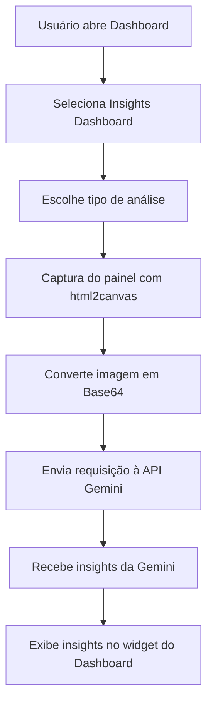

# zbx-t00lkit

Repositório para armazenar e versionar templates de monitoramento para Zabbix.
Aqui você encontra templates organizados por tipo de dispositivo para facilitar a importação e manutenção.

---

## Sobre

Este projeto nasceu como um backup pessoal de templates, mas está aberto para quem quiser usar, colaborar, corrigir e aprimorar.
O objetivo é ajudar a comunidade com templates úteis e fáceis de adaptar.

---

## Estrutura do repositório

```bash
zbx-t00lkit/
├── LICENSE
├── README.md
├── scripts/
│   ├── zbx_backup.sh        # Scripts para backup do Zabbix
│   └── zbx_install.sh       # Scripts para instalação/configuração automatizada
├── Scripts/AI_Assistance/   # Script que envia triggers do Zabbix para Google Gemini
│   ├── AI_Assistance.js
│   └── README.md
├── Scripts/widgets/insights/ # Widget opcional para dashboards Zabbix
│   ├── assets/js/class.widget.php.js
│   ├── manifest.json
│   └── README.md
├── releases/
│   └── insights.zip         # Arquivo zip do widget Insights Dashboard
└── templates/
    ├── Central_Telefonica/  # Templates para centrais telefônicas
    ├── firewall/            # Templates para firewalls
    ├── impressoras/         # Templates para impressoras (Brother, HP, etc)
    ├── pcs/                 # Templates para estações Windows/Mac com agente Zabbix
    └── Storage/             # Templates para dispositivos de armazenamento (ex: QNAP)
```

---

## Formatos dos templates

Cada template está disponível nos seguintes formatos:

* `.json` — formato JSON padrão do Zabbix
* `.xml` — formato XML clássico para importação
* `.yaml` — formato YAML, mais legível e fácil de editar

---

## Como usar

1. Clone o repositório:

   ```bash
   git clone https://github.com/Zer0G0ld/zbx-t00lkit.git
   ```
2. Navegue até a pasta do template desejado:

   ```bash
   cd zbx-t00lkit/templates/impressoras/Brother
   ```
3. Importe o template via interface web do Zabbix (**Dados Coletados > Templates > Importar**).
4. Ajuste conforme sua infraestrutura.

---

## Contribuições

Contribuições são bem-vindas:

* Abra uma issue para sugerir melhorias ou reportar problemas.
* Faça um fork e envie um pull request com alterações.
* Mantenha a organização da estrutura e o padrão dos arquivos.
* Descreva claramente as mudanças feitas.

---

## Ambiente usado para testes

* Sistema Operacional: Debian 12
* Versão do Zabbix: 7.0 LTS
* Banco de Dados: PostgreSQL

---

## 📌 Novos recursos

### 1. AI Assistance

Script que envia alertas de triggers para a API Gemini do Google e retorna possíveis causas, comandos de debug e medidas preventivas.

Instalação detalhada: [`Scripts/AI_Assistance/README.md`](Scripts/AI_Assistance/README.md)

### 2. Insights Dashboard

Widget opcional que captura visualmente o dashboard do Zabbix e gera insights com IA (Google Gemini).

Instalação detalhada: [`Scripts/widgets/insights/README.md`](Scripts/widgets/insights/README.md)

---

## 📊 Widget Insights Dashboard

O **Widget Insights Dashboard** permite capturar automaticamente o painel do Zabbix e gerar **insights visuais com IA**.

### 🚀 Passo 1 – Instalação

```bash
cd /usr/share/zabbix/widgets/
wget https://github.com/Zer0G0ld/zbx-t00lkit/raw/refs/heads/main/Scripts/insights.zip
unzip insights.zip
```

### 🔧 Passo 2 – Ajustar permissões

```bash
sudo chown -R www-data:www-data /usr/share/zabbix/widgets/insights
sudo chmod -R 755 /usr/share/zabbix/widgets/insights
```

> ⚠️ Substitua `www-data` pelo usuário do servidor web do Zabbix (ex.: `apache`, `nginx`, `zabbix`), caso seja diferente.

### 📂 Passo 3 – Estrutura de arquivos esperada

```
/usr/share/zabbix/widgets/insights/
├── assets/js/class.widget.php.js
├── manifest.json
└── manifest.json~
```

### ⚙️ Passo 4 – Configuração do widget

1. Abra o arquivo `assets/js/class.widget.php.js`
2. Localize a linha do `fetch` para a API do Google Gemini
3. Insira sua **API Key**
4. Salve o arquivo

### 📌 Passo 5 – Uso no Dashboard

1. Vá em **Dashboard → Adicionar Widget → Insights Dashboard**

2. Selecione o tipo de análise:

   * **Resumo**
   * **Diagnóstico**
   * **Comparação**
   * **Previsão**
   * **Perspectivas**
   * **“O que você faria?”**

3. Clique em **Analisar**

4. Aguarde a geração do relatório de insights

> ⏳ O tempo pode variar conforme o tamanho do dashboard e a largura de banda.

### 🧠 Como funciona

* Captura o dashboard com **html2canvas**
* Converte a captura em **Base64**
* Envia a imagem + prompt à **API Gemini**
* Exibe os insights diretamente no widget

### 🔄 Fluxo do Widget Insights Dashboard



---

## Licença

Este projeto está licenciado sob a [GNU General Public License v3.0](./LICENSE).

---

## Contato

Para dúvidas ou sugestões, abra uma issue ou entre em contato!
