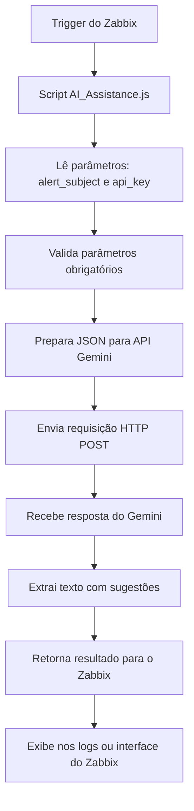

## Script AI Assistance

### O que ele faz

O **AI Assistance** recebe alertas do Zabbix e envia para a API **Gemini** do Google, que retorna:

* Possíveis causas do problema
* Sugestões de comandos de depuração
* Ações preventivas para evitar recorrência

💡 Resumindo: **alerta do Zabbix → Gemini → retorno com insights → Zabbix mostra**

---

### Passo 1 – Salvar script

```bash
sudo mkdir -p /usr/lib/zabbix/alertscripts
sudo nano /usr/lib/zabbix/alertscripts/AI_Assistance.js
# Cole o conteúdo do script aqui
sudo chmod 755 /usr/lib/zabbix/alertscripts/AI_Assistance.js
```

> ⚠️ Você vai precisar da sua **API Key do Gemini**, que pode ser obtida aqui: [AI Studio – Gerar API Key](https://aistudio.google.com/app/apikey)

---

### Passo 2 – Criar script no Zabbix

* Menu: **Alertas → Scripts → Criar script**

* Nome: `AI Assistance`

* Escopo: `Ação manual do evento`

* Tipo: `Webhook`

* **Parâmetros**:

  * `alert_subject` = `{TRIGGER.NAME}`
  * `api_key` = `SUA_API_KEY`

* Script: selecione o arquivo salvo acima (`AI_Assistance.js`)

---

### Passo 3 – Testar

1. Vá em **Problemas → Histórico**
2. Selecione uma trigger e execute o script
3. Verifique os logs em **Zabbix → Administração → Logs** ou no console do servidor

> ⚠️ **Dica:** teste sempre com triggers históricas antes de usar em produção.


### Diagrama

